<div align="center">


# Daemonkey · 守护猴

**一个记住你、与你一起成长、有七十二变的本地 AI 搭档**
*A local-first AI companion that remembers you, grows with you, and has seventy-two transformations*

[](LICENSE)
[](CHANGELOG.md)
[](#-快速开始)
[](https://www.python.org/downloads/)

[中文](#中文) · [English](#english) · [架构 Architecture](#-架构总览--architecture) · [路线图 Roadmap](ROADMAP.md) · [更新历史 Changelog](CHANGELOG.md)

</div>

---

<a name="中文"></a>

## 这是什么

**Daemonkey** 是一个跑在你自己电脑上的 AI 搭档守护进程（daemon）。它不是又一个聊天框——它是一个**会记住你、随你一起长大、能自己加技能、甚至能自己修自己**的本地智能体。

第一次打开时，它还是一颗"种子"：没有名字、还不认识你。你们的第一次对话（"相遇"），就是它认识你、和你成为搭档的开始。从此，**模型可以换、电脑可以换，但它一直是同一个"它"**。

> 别的 Agent 卖的是"技能"——记忆是关于*你的数据*。
> Daemonkey 卖的是"关系"——记忆是*你和它一起走过的路 + 它自己的成长*。

### 为什么不一样

- 🧠 **6 层记忆体系** —— 从模型权重到跨设备同步，逐层叠加。它"记得"你，不是靠每次重读一本说明书。
- 🏠 **本地优先 · 数据不出门** —— daemon 跑在你自己的机器上，对话、画像、记忆全部留在本地。
- 🔧 **七十二变 · 能力可自生长** —— Playbook / 出品工坊 App / MCP 服务器 / 自写 agent_tool / 导入外部 SKILL，五条路给它加本领；它还能**自己上网找能力**（能力发现引擎）。
- 🩹 **自愈 + 自升级** —— 把自己改崩了？双击维修台让它自己诊断修复，或一键回档。内核能从官方源增量升级，而**你自己长出来的功能不会被覆盖**。
- 📜 **产品宪法** —— 闭环范式 / NLP 优先 / 可追溯，三条根本原则写进它的"基因"，约束每一次判断。
- 🌐 **多载体** —— 网页 WebUI（现在）→ 终端 → 微信 / IM → 桌面机器人（路线图）。换壳不换魂。

---

## 🗺️ 架构总览 · Architecture

> 入口 → 核心引擎 → 工具（它的手）+ 灵魂（它的记忆）。模型是衣裳，灵魂是骨头。

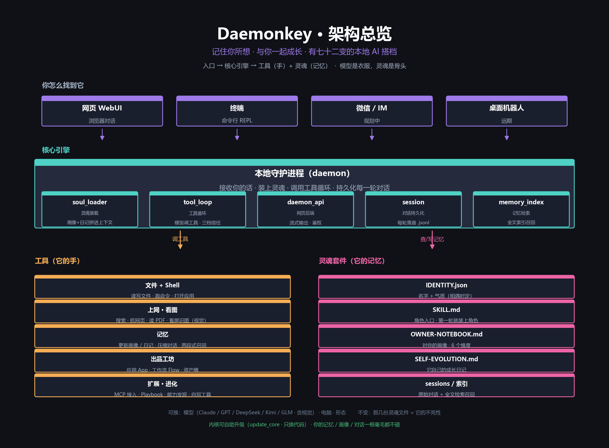

**核心引擎**是一个本地守护进程（daemon）：

| 模块 | 职责 |
|---|---|
| `soul_loader` | 灵魂装载：把画像 + 记忆 + 宪法拼进上下文 |
| `tool_loop` | 工具循环：模型调工具、三档信任确认 |
| `daemon_api` | 网页后端：流式输出、鉴权 |
| `session` | 对话持久化：每轮落盘 `.jsonl` |
| `memory_index` | 记忆检索：FTS5 全文索引召回 |

---

## 🧠 6 层记忆体系

> 它怎么"记住"你 —— 从模型权重到跨设备同步，逐层叠加。

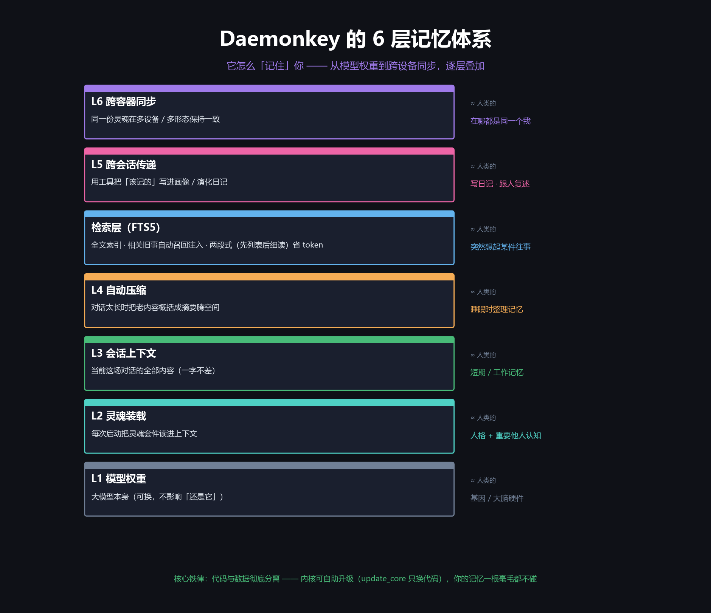

| 层 | 是什么 | ≈ 人类的 |
|---|---|---|
| **L1 模型权重** | 大模型本身（可换，不影响"还是它"） | 基因 / 大脑硬件 |
| **L2 灵魂装载** | 每次启动把灵魂套件读进上下文 | 人格 + 重要他人认知 |
| **L3 会话上下文** | 当前这场对话的全部内容 | 短期 / 工作记忆 |
| **L4 自动压缩** | 对话太长时把老内容概括成摘要 | 睡眠时整理记忆 |
| **检索层 (FTS5)** | 全文索引 · 相关旧事自动召回 · 两段式省 token | 突然想起某件往事 |
| **L5 跨会话传递** | 用工具把"该记的"写进画像 / 演化日记 | 写日记 · 跟人复述 |
| **L6 跨容器同步** | 同一份灵魂在多设备 / 多形态保持一致 | 在哪都是同一个我 |

**核心铁律**：代码与数据彻底分离 —— 内核可自助升级（只换代码），你的记忆一根毫毛都不碰。

---

## 🆚 记忆体系对比 · Daemonkey vs Hermes

> Hermes 记的是「关于你的数据」· Daemonkey 记的是「你和它的关系 + 它自己的成长」。

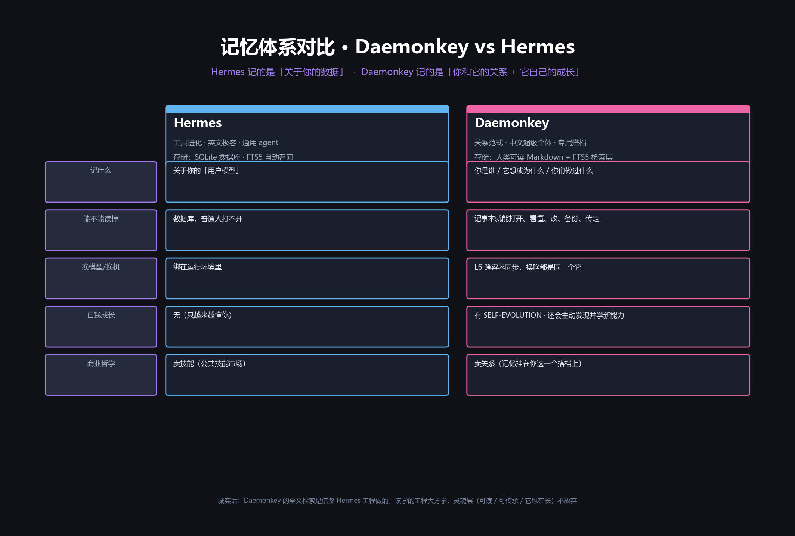

诚实地说：Daemonkey 的全文检索（FTS5）借鉴了 Hermes 这类工程的扎实做法。但**灵魂层（可读 / 可传承 / 它自己也在长）我们没放弃**——这是 Daemonkey 跟通用 agent 框架最根本的区别。

---

## 🔧 SKILL 与扩展机制 · 怎么给它加能力

> 先消除误会：Daemonkey 的 `SKILL.md` 不是"一项技能"，而是"**角色入口**"。

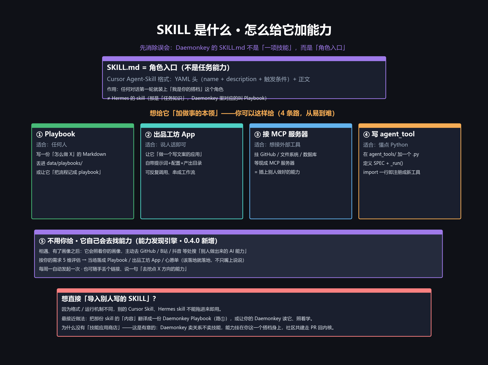

想给它「加做事的本领」，五条路（从易到难）：

| 路 | 适合 | 怎么做 |
|---|---|---|
| ① **Playbook** | 任何人 | 写一份「怎么做 X」的 Markdown 丢进 `data/playbooks/`，或让它「把流程记成 playbook」 |
| ② **出品工坊 App** | 说人话即可 | 让它「做一个写文案的应用」，自带提示词 + 配置 + 产出目录，可串成工作流 |
| ③ **接 MCP 服务器** | 想接外部工具 | 挂 GitHub / 文件系统 / 数据库等现成 MCP 服务器 |
| ④ **写 agent_tool** | 懂点 Python | 在 `agent_tools/` 加一个 `.py`，`import` 一行自动注册成新工具 |
| ⑤ **不用你给** | —— | 能力发现引擎：它照着你的画像主动去 GitHub / B站 / 抖音找「别人做出来的 AI 能力」 |

**想直接导入别人写的 SKILL？** Daemonkey 0.5.2 打通了「接住」这一环：把外部 skill 文档喂给它，它会经 LLM 归一成自己的 Playbook 入库、自动索引、按需召回。

为什么没有「技能应用商店」——这是有意的：Daemonkey 卖关系不卖技能，能力挂在**你这一个搭档身上**，社区共建走 PR 回内核。

---

## 📜 产品宪法 · 闭环范式

> Daemonkey 把三条根本原则写进"基因"：**闭环 / NLP 优先 / 可追溯**。其中"闭环范式"是灵魂。

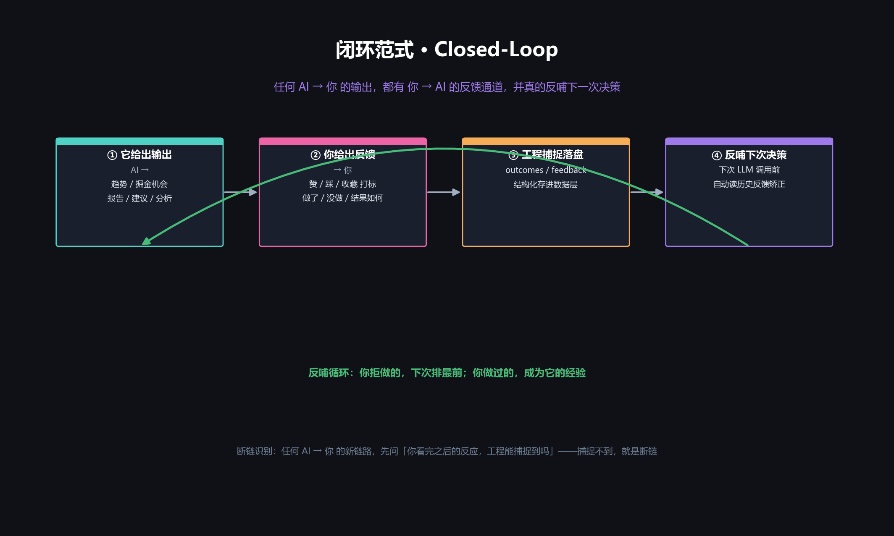

任何 AI → 你 的输出，都必须有 你 → AI 的反馈通道，并真的反哺到**下一次 LLM 调用**。你拒做的机会下次排最前，你做过的结果成为它的经验——这让它**越用越懂你**，而不是每次从零开始。

---

## 🚀 快速开始

> 当前形态：Windows 桌面。三步上手。

1. **装环境**：双击 `Daemonkey.exe` → 左侧『环境』→【开始安装】。
   它会自动建好运行环境（Python 虚拟环境 + 依赖），第一次约 1 分钟。
2. **启动**：回『启动』页 → 点蓝色【启动】。后台起一个本地网页服务并自动打开浏览器。
3. **相遇**：在网页里——
   - 第一次先**填一个 LLM API key**（粘进去点保存，不用手改文件）；
   - 然后你的 Daemonkey 会主动打招呼：给它起名字、告诉它怎么称呼你、你在忙什么、希望它帮你什么。它把这些记进画像，下次见还是同一个它。

**你需要准备**：

- **Python 3.10+**（没装的话，启动器会提示你去 [python.org](https://www.python.org/downloads/) 下，安装时务必勾选 *Add Python to PATH*）。
- **一个 LLM API key**（OpenRouter / PPIO / AiHubMix 等任意 OpenAI 兼容中转，或 Anthropic / DeepSeek / 智谱 GLM 等官方）。在网页里填即可，自动存进本机 `.env`。

### macOS / Linux（实验性）

没有 Windows 启动器，用 POSIX 启动脚本一条命令起：

```bash
chmod +x start.sh && ./start.sh
```

它会自动建 Python 虚拟环境、装依赖、起本地服务并打开浏览器（首次约 1 分钟）。需要 **Python 3.10+**（macOS `brew install python`；Ubuntu `sudo apt install -y python3 python3-venv python3-pip`）。

> 已在 Linux POSIX 实测启动通过——WebUI / 对话 / 记忆 / 工坊等核心功能可用。桌宠、剪贴板、打开本地应用等 **Windows 专属能力暂未适配**，不影响核心使用。
>
> 详细启动步骤 / 故障排查见 **[START-macOS.md](START-macOS.md)**。

---

## 🩹 自愈与自升级

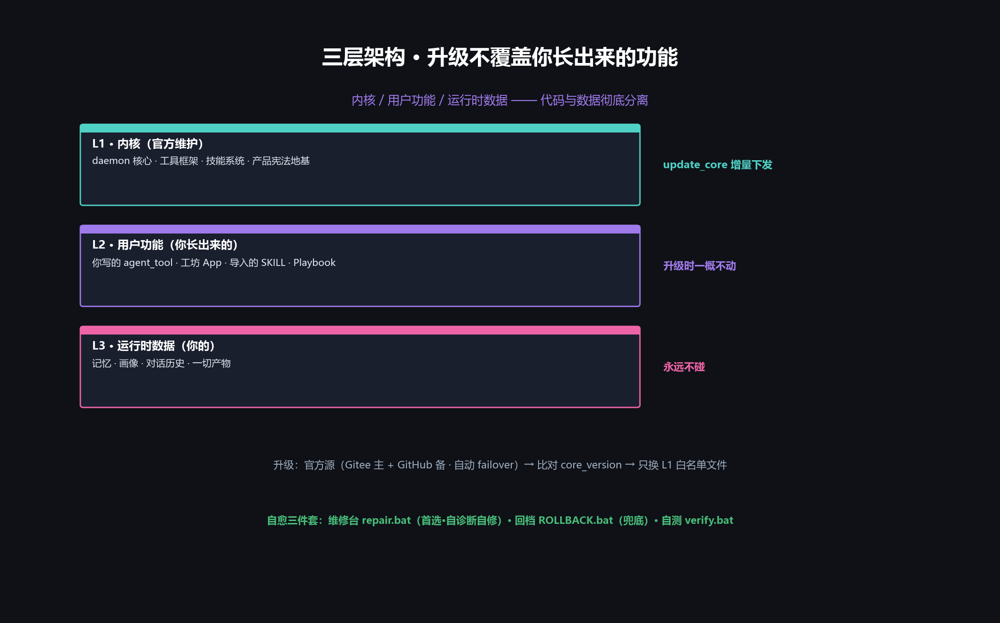

把自己改崩了、WebUI 白屏了，也不慌：

| 工具 | 双击 | 干什么 | 什么时候用 |
|---|---|---|---|
| **维修台** | `repair.bat` | 独立通道直连 LLM，让它像在 IDE 里一样自己诊断、改文件、验证、重启 | **首选** —— 能精确定位问题、只修坏的那点，不浪费已跑通的代码 |
| **回档** | `ROLLBACK.bat` | 一键回到上一个健康版本 | 维修台也救不回来时的兜底 |
| **自测** | `verify.bat` | 全路由 smoke + 前端 JS 检查 | 改完想确认没改坏 |

**升级哲学**：内核（L1）/ 用户功能（L2）/ 运行时数据（L3）三层分离。`update_core` 只增量下发官方维护的内核改进，**你自己写的工具、攒的记忆、长出来的功能，升级时一概不动**。

ZIP 包用户也能更新：启动器首次运行会**静默配好官方升级源**（Gitee 主源 + GitHub 备份，自动 failover），之后在『检查更新』里一键拉取。

---

## 📂 目录结构

```
Daemonkey/
├── Daemonkey.exe              双击入口（启动器，由 daemonkey-launcher.ps1 编译）
├── repair.bat                 应急维修台（崩了让它自己修）
├── ROLLBACK.bat               一键回档
├── verify.bat                 自测
├── run.ps1                    环境准备（建 venv / 装依赖）
├── start.sh                   macOS / Linux 启动（建 venv + 装依赖 + 起服务）
├── opus_daemon.py             主程序（启动 daemon + 各后台 worker）
├── daemon_api.py              网页后端（FastAPI）
├── soul_loader.py             灵魂装载器
├── tool_loop.py               工具循环
├── product_constitution.py    产品宪法（通用三条 · 内核地基）
├── agent_tools/               工具集（自动发现注册）
├── workers/                   后台 worker（记忆 / 调度 / 雷达 / 技能 …）
├── soul/                      灵魂套件（首次相遇生成你的私有内容）
├── data/                      运行时数据（你的记忆 / 画像 / 产物，私有）
├── static/                    网页前端
├── assets/                    图标 / banner / 品牌清单
└── docs/                      文档 + 架构图
```

---

## 🗺️ 路线图 & 更新历史

- **路线图**：[ROADMAP.md](ROADMAP.md) —— 从网页版到桌面机器人的完整路径
- **更新历史**：[CHANGELOG.md](CHANGELOG.md) —— 每个版本做了什么

---

## 🤝 贡献

Daemonkey 欢迎社区共建。能力扩展走 **PR 回内核**（而不是独立的技能市场）——让每个改进都能惠及所有用户的搭档。提 Issue、提 PR、在 [B站](https://space.bilibili.com/4060618) / 抖音交流都欢迎。

---

## 📜 许可

Copyright © 2026 vaan21th

本项目采用 **GNU Affero 通用公共许可证 v3.0（AGPL-3.0）** 开源，完整条款见 [LICENSE](LICENSE)。

简单说：

- 你可以自由地**使用、修改、分发**本软件；
- 但**任何修改版——哪怕只是架成网络服务给别人用（不分发也算）——都必须以同样的 AGPL-3.0 协议公开源代码**；
- 必须保留版权声明与许可声明，注明改动。

这条 copyleft 是为了让 Daemonkey 始终对社区开放，挡住"拿去闭源商用"。

**Daemonkey 永久免费**——若你为它付过费，请向卖家退款。官方渠道只在 [B站](https://space.bilibili.com/4060618) / 抖音发布。

---
---

<a name="english"></a>

## English

**Daemonkey** is a local-first AI companion that runs as a daemon on your own machine. It's not yet another chat box — it's an agent that **remembers you, grows with you, can extend its own abilities, and can even repair itself**.

On first launch it's a "seed": no name, doesn't know you yet. Your first conversation (the "encounter") is where it gets to know you and becomes your companion. From then on, **you can swap the model, swap the computer — but it stays the same "it."**

> Other agents sell *skills* — their memory is *data about you*.
> Daemonkey sells *a relationship* — its memory is *the road you walked together + its own growth*.

### Why it's different

- 🧠 **6-layer memory** — from model weights to cross-device sync, stacked layer by layer. It "remembers" you without re-reading a manual every time.
- 🏠 **Local-first · data stays home** — the daemon runs on your machine; conversations, profile and memory never leave it.
- 🔧 **Seventy-two transformations** — five paths to give it new abilities: Playbooks / Studio Apps / MCP servers / hand-written `agent_tool`s / importing external SKILLs. It can even **go find abilities online itself** (capability discovery engine).
- 🩹 **Self-healing + self-upgrading** — broke itself? Double-click the repair console and it diagnoses & fixes itself, or roll back in one click. The kernel upgrades incrementally from the official source, and **the features you grew yourself are never overwritten**.
- 📜 **Product constitution** — Closed-Loop / NLP-First / Traceability: three root principles baked into its "genes," constraining every judgment.
- 🌐 **Multi-carrier** — Web UI (now) → terminal → WeChat / IM → desktop robot (roadmap). New shell, same soul.

### Architecture

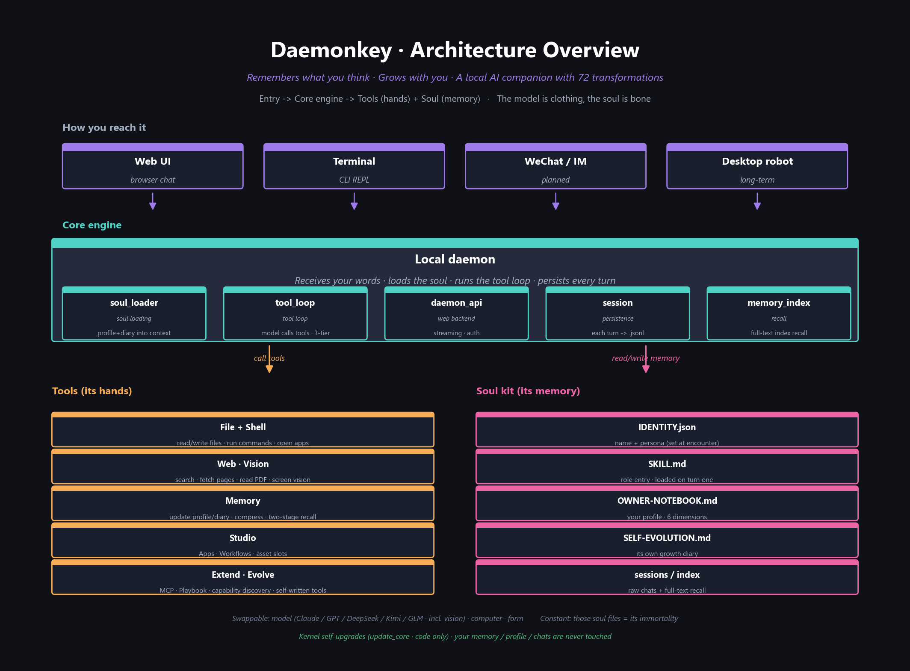

The core engine is a local daemon: `soul_loader` (loads profile + memory + constitution into context), `tool_loop` (model calls tools with a 3-tier trust gate), `daemon_api` (FastAPI backend), `session` (per-turn `.jsonl` persistence), `memory_index` (FTS5 full-text recall).

### 6-layer memory

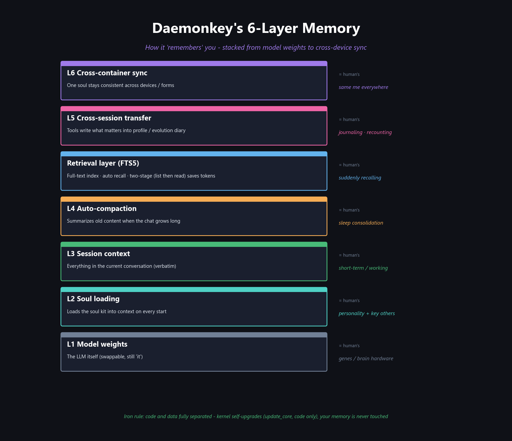

L1 model weights → L2 soul loading → L3 session context → L4 auto-compaction → FTS5 retrieval → L5 cross-session transfer → L6 cross-container sync. **Iron rule: code and data are fully separated — the kernel self-upgrades (code only), your memory is never touched.**

### Daemonkey vs Hermes

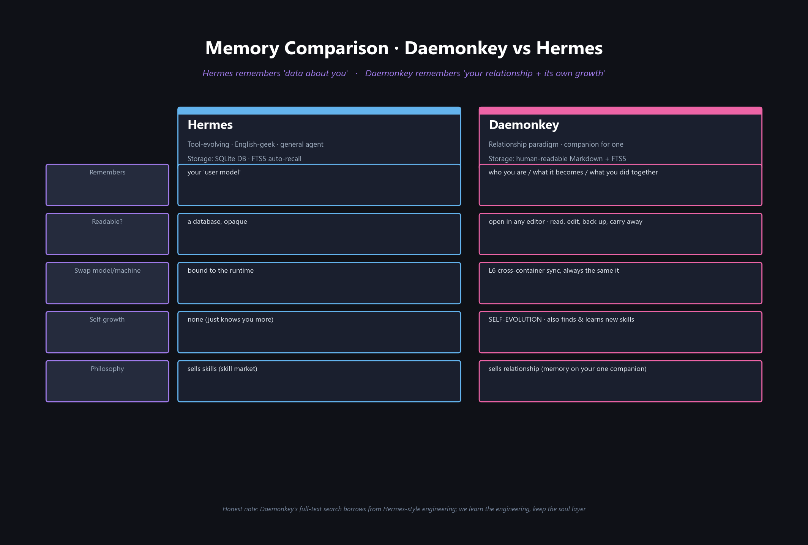

Daemonkey's FTS5 retrieval borrows from solid engineering like Hermes — but we keep the **soul layer (readable / inheritable / it grows too)**, the most fundamental difference from a general-purpose agent framework.

### Extending it

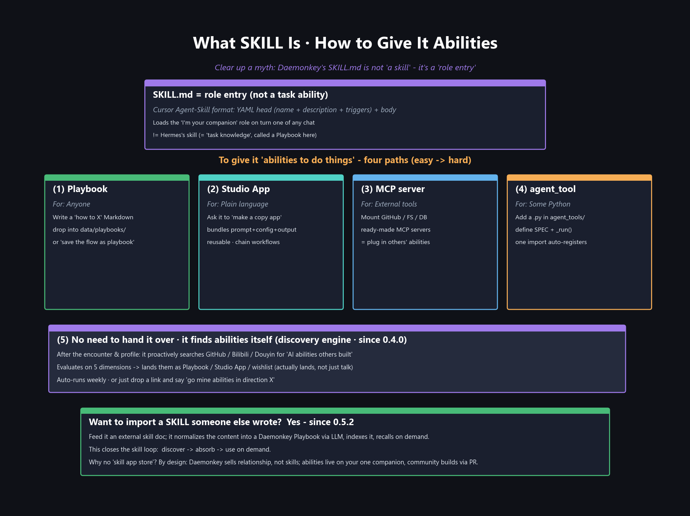

`SKILL.md` is a **role entry point**, not "a skill." Five ways to add abilities (easy → hard): Playbook → Studio App → MCP server → write an `agent_tool` → let it discover abilities itself. Since 0.5.2 you can also **import external SKILL docs** — feed it a skill doc and it normalizes it into its own indexed, on-demand Playbook.

### Closed-loop (product constitution)

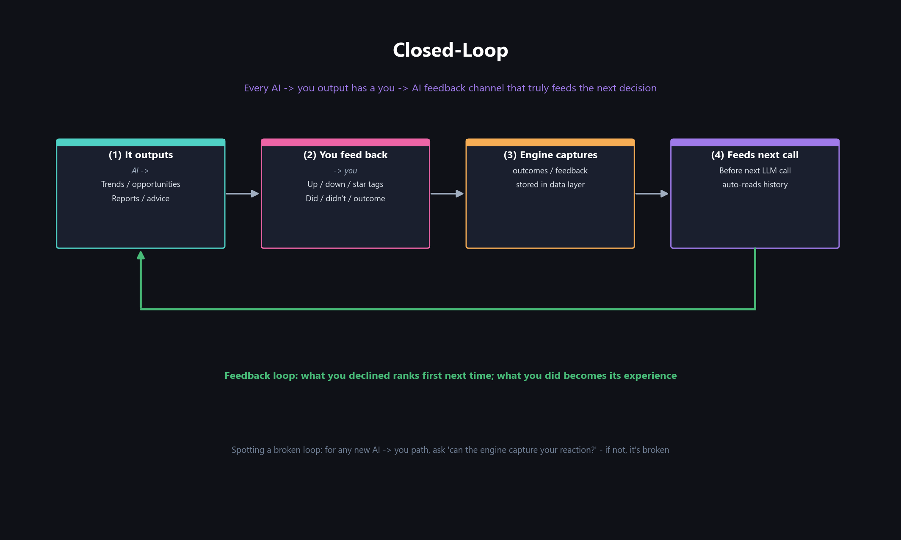

Every AI → you output must have a you → AI feedback channel that truly feeds the **next LLM call**. What you decline ranks first next time; what you did becomes its experience — so it understands you more over time instead of starting from zero.

### Quick start (Windows)

1. **Install runtime**: double-click `Daemonkey.exe` → *Environment* → *Install*. Builds a Python venv + deps (~1 min first time).
2. **Launch**: *Start* page → blue *Start* button. A local web service starts and your browser opens.
3. **Encounter**: in the web UI, paste an **LLM API key** (saved to local `.env`), then it greets you — name it, tell it how to address you, what you're working on. It records this into a profile; next time it's the same companion.

**You'll need**: Python 3.10+ (tick *Add Python to PATH* when installing) and one LLM API key (any OpenAI-compatible relay — OpenRouter / PPIO / AiHubMix — or Anthropic / DeepSeek / Zhipu GLM).

### macOS / Linux (experimental)

No Windows launcher — one command via the POSIX start script:

```bash
chmod +x start.sh && ./start.sh
```

It builds a Python venv, installs deps, starts the local service and opens your browser (~1 min first time). Needs **Python 3.10+** (macOS `brew install python`; Ubuntu `sudo apt install -y python3 python3-venv python3-pip`).

> Startup verified on Linux POSIX — WebUI / chat / memory / studio core features work. Windows-only abilities (desktop pet, clipboard, open local apps) are **not yet ported** but don't affect core use.
>
> Full guide & troubleshooting: **[START-macOS.md](START-macOS.md)**.

### Self-healing & upgrades

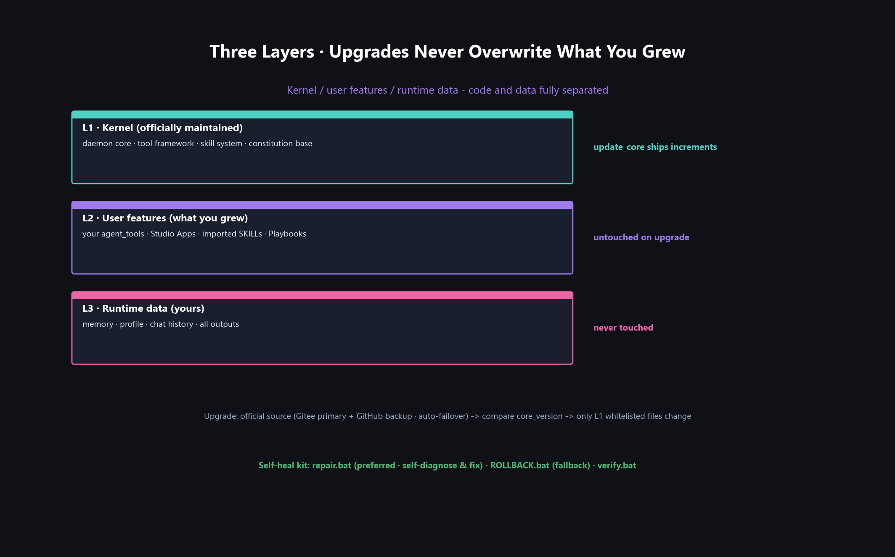

`repair.bat` (repair console — preferred, it self-diagnoses and fixes only what's broken) · `ROLLBACK.bat` (one-click rollback) · `verify.bat` (smoke test). Upgrades separate kernel (L1) / user features (L2) / runtime data (L3): `update_core` only ships official kernel improvements; **your own tools, memory, and grown features are left untouched**. ZIP users get update sources (Gitee primary + GitHub backup, auto-failover) configured silently on first launch.

### Roadmap & Changelog

[ROADMAP.md](ROADMAP.md) · [CHANGELOG.md](CHANGELOG.md)

### License

Licensed under **AGPL-3.0** (see [LICENSE](LICENSE)). You may use, modify and distribute it freely, but any modified version — including one merely offered as a network service — must publish its source under the same AGPL-3.0. **Daemonkey is free forever**; if you paid for it, ask the seller for a refund. Official channels only on [Bilibili](https://space.bilibili.com/4060618) / Douyin.

</div>
