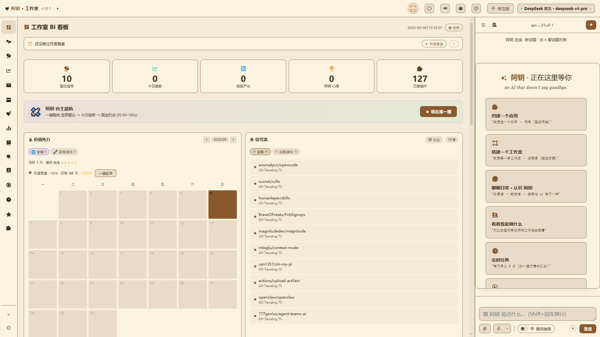
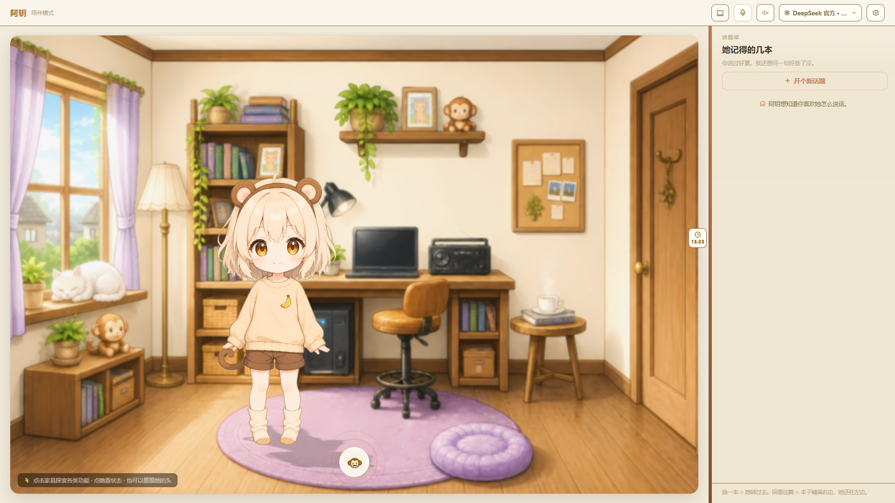
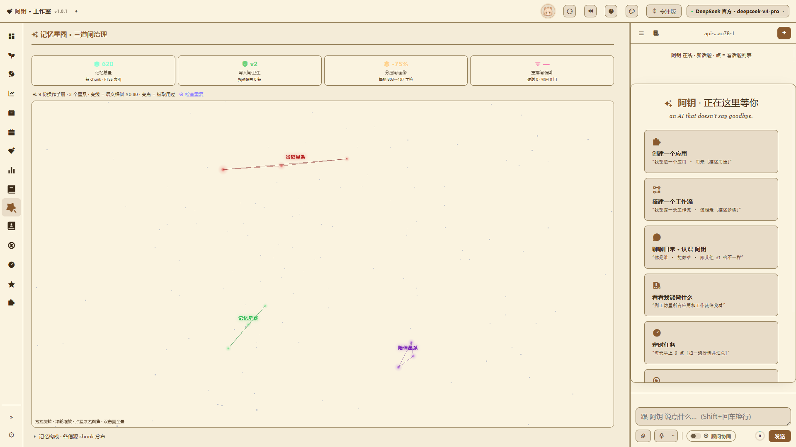
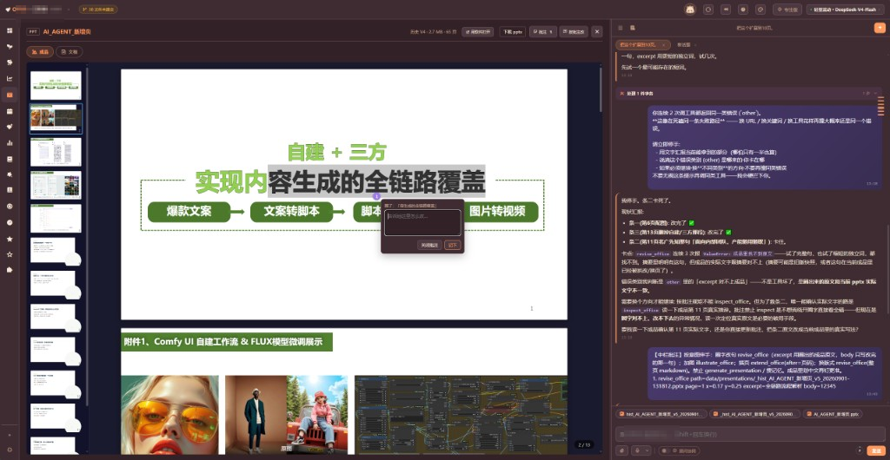
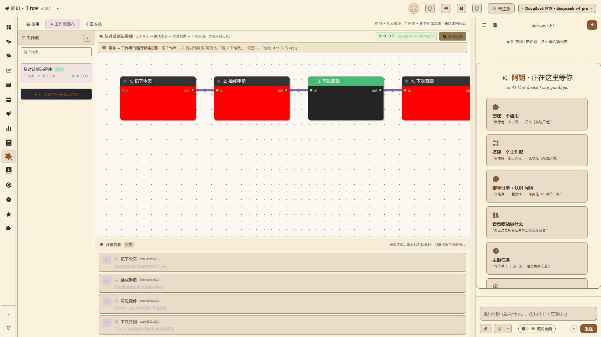
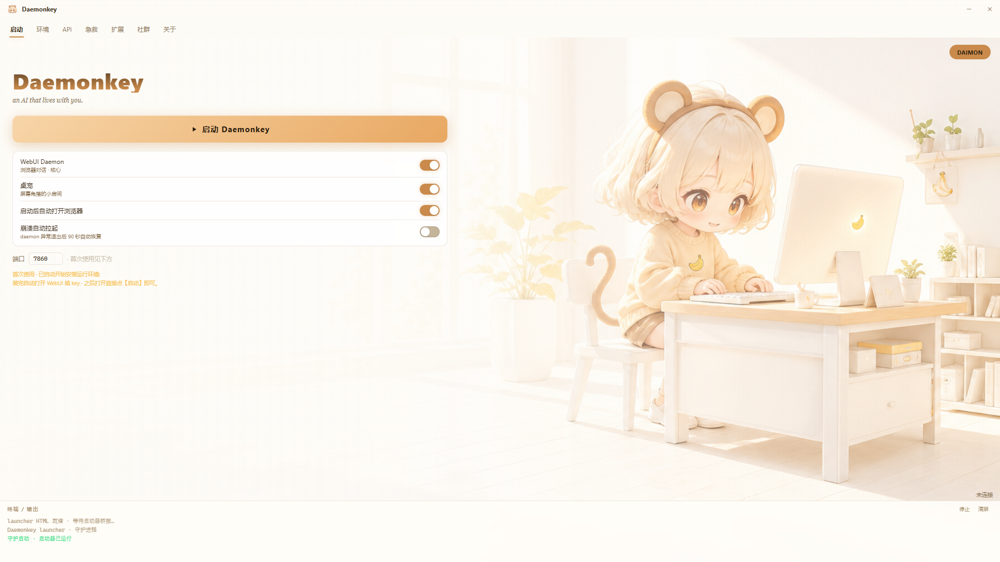
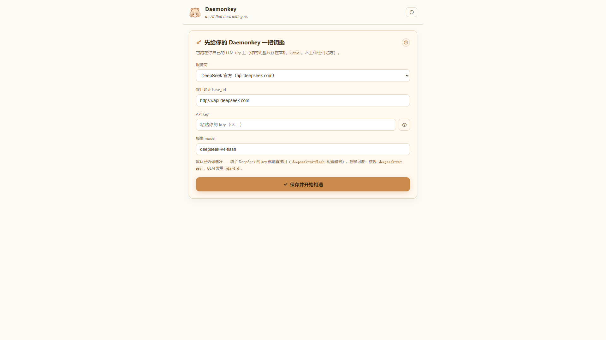

<div align="center">

# Daemonkey · 守护猴

**跑在你自己电脑上的 AI 搭档：记得你，能把事做成文件，房间里也能陪着。**  
*A local-first AI companion that remembers you, turns talk into files, and can sit with you in a room.*

[](LICENSE)
[](CHANGELOG.md)
[](#三步上手)
[](https://www.python.org/downloads/)

[中文](#中文) · [English](#english) · [ATM-Bench](#atm-bench) · [路线图](ROADMAP.md) · [更新历史](CHANGELOG.md)

</div>

---

<a name="中文"></a>

## 这是什么

Daemonkey 不是又一个网页聊天框。它是装在你电脑上的后台程序：第一次对话之后，你就有了**属于自己的专属 AI**。换模型、换电脑，它怎么叫、怎么叫你、聊过什么还在。

别人记住的是关于你的几条资料。  
这里留下的是你们一起做过的事，加上它自己也在长。

换模型没关系。属于你的那一份还在。

<p align="center">
  
  <br>
  <sub>工作台：中间看板和稿，右边随时能开口。图里她叫阿钥，名字是你起的。</sub>
</p>

<p align="center">
  
  <br>
  <sub>房间：干活之外，它有一个在的地方。名字是你起的。</sub>
</p>

<p align="center">
  
  <br>
  <sub>记忆星图：手册和记忆聚成星系。灵魂来自记忆，不是写在提示词里的人设。</sub>
</p>

<p align="center">
  
  <br>
  <sub>中栏打开 PPT，圈一段、钉一条，只改圈出来的部分。</sub>
</p>

<p align="center">
  
  <br>
  <sub>演示流：记下今天 → 抽成手册 → 写进画像 → 下次召回。</sub>
</p>

<p align="center">
  
  <br>
  <sub>Windows 双击启动器。环境、启动、桌宠都在这一页。</sub>
</p>

<p align="center">
  
  <br>
  <sub>第一次：填一把 OpenAI 兼容接口的 Key，开始相遇。</sub>
</p>

---

## 打开之后能干什么

| | |
|---|---|
| **工作台** | 左边聊天，中间打开 PPT / Word / Excel。圈一段字、钉一句批注，只改圈出来的部分，不用整份重做。 |
| **房间和桌宠** | 工作台用来干活，房间是它在的地方。桌宠可以贴在屏幕边上。点家具、摸摸头，都是同一份记忆。 |
| **自己加本事** | 说一句话做个应用、串一条工作流、把流程记成操作手册。也能接网上现成的工具，或让它自己去找。 |
| **人不在电脑前** | 微信、飞书把话递进来。定时任务到点自己干。 |
| **改崩了能修** | 维修台让它自己看。回档回到上一版还能用的内核。官方升级只换程序，不碰你的记忆和稿。 |

---

## 为什么越用越便宜、越记得住

每次开口，模型都要先读一段**固定说明书**（提示词前缀），再读你刚说的话。说明书越短、越稳定，后面几句就越不用把前面那一大段再付一遍钱。

出厂实测（2026-09，空画像、工具目录开启）：

| | Daemonkey 1.0.1 | 对照 |
|---|---|---|
| **固定说明书** | 约 **1.9 万 token**（说明 1.06 万 + 常用 35 个工具 0.88 万） | 按照工具调用召回 |
| **工具目录** | **8113 字**（只列名字，用到再展开；另有 92 个不常用工具） | 低于 [OpenClaw](https://github.com/openclaw/openclaw) 同类目录上限 **1.8 万字** |
| **前缀缓存命中** | 长对话 **95% 以上** | |

怎么做到的：每轮会变的内容（时间、进度）放到最后，前面保持不动，磁盘缓存就能对上。常用工具全文放进说明书，其余 90 多个只进目录。画像用久了会分层：改说话的短条每轮都在，流水不必每次灌完——实测每轮常驻说明大约少 **68%**。

记得多不是本事，记得干净才是。先挡住不该记的；找旧事时先全文搜，再用模型挑真相关的。你拒过的下次会排到前面，做过的下次更知道怎么做。

---

<a name="atm-bench"></a>

## ATM-Bench：同一个模型，分差在架构

[ATM-Bench](https://atmbench.github.io/)（[arXiv 2603.01990](https://arxiv.org/abs/2603.01990)）测的是长期记忆问答：四年跨度的相册、视频、邮件，31 道难题。我们把 Daemonkey **自己的记忆引擎**接进去跑，答题和打分都用 DeepSeek 官方 `deepseek-v4-flash`，不拿别人的宣传图。

| 怎么记 | 得分（31 题） |
|---|---|
| 一次性关键词搜索 | 9.7% |
| OpenCode 官方（DeepSeek V4 Flash） | 38.3% |
| Daemonkey 多轮自己翻记忆 | 41.9% |
| **多轮翻记忆 + 再排一次** | **51.6%（16/31）** |

---

## 它怎么跑起来

没有云数据库。后台程序在你这台机器上，旁边接 **OpenAI 兼容 API**，底下是文件。

```
你
 ├── 启动器（Windows 双击 exe / Mac 一条命令）
 └── 本机 Daemonkey
       ├── 大脑：任何 OpenAI 兼容接口（官方或中转，模型你自己选）
       ├── 工作台 · 房间 · 微信 / 飞书
       └── 只存在你硬盘上的东西
             它是谁、你是谁、对话、稿、记忆索引
```

工作台、房间、微信是外壳。换外壳，里面还是同一个它。

---

## 和普通聊天框差在哪

| | 普通聊天框 | Daemonkey |
|---|---|---|
| 第一次打开 | 一个通用助手 | 聊完，你得到属于自己的专属 AI |
| 记忆 | 关了就忘，或只剩云端摘要 | 画像、日记、检索，全在本地 |
| 干活 | 给你一段字 | 落成 PPT / Word / 表，圈字还能改 |
| 陪伴 | 人设写在提示词里 | 房间和桌宠站得住，是因为记得你们的路 |
| 升级 | 人跟着产品走 | 程序升级，你的东西不动 |

---

## 三步上手

**Windows**

1. 双击 `Daemonkey.exe` → 环境 → 开始安装。第一次大约一分钟。  
2. 回到启动页，点启动。浏览器会自己打开。  
3. 填一个大模型 API Key，给它起名字，告诉它怎么叫你。这些写进画像。

**macOS / Linux**

```bash
chmod +x start.sh && ./start.sh
```

Mac 也可以把 `Daemonkey.app` 放进这份代码的根目录（和 `tools/` 同级）再双击。不要只把应用单独丢进「应用程序」。详见 [MAC-GUIDE.md](MAC-GUIDE.md)。

你需要：**Python 3.10+**（安装时勾选 Add to PATH），以及一个 **OpenAI 兼容 API** 的 Key（官方或中转都行）。

崩了也不慌：

| 双击 | 干什么 |
|---|---|
| `repair.bat` | 维修台：它自己看、改、验 |
| `ROLLBACK.bat` | 回到上一版还能用的内核 |
| `verify.bat` | 快速自测 |

ZIP 包用户：启动器第一次会配好官方升级源（Gitee 主、GitHub 备份）。之后在启动器里「检查更新」，或对话里说一声即可。

---

## 下一步

完整路线图见 [ROADMAP.md](ROADMAP.md)。一句话：近处把工作台和房间打磨扎实；远处是多设备还是同一个它，以及真正的桌面机器人。不做云端 SaaS，不绑死一家模型。

---

## 许可

Copyright © 2026 vaan21th · **[AGPL-3.0](LICENSE)**。

可以自用、修改、分发。改过的版本——哪怕只是架成网上服务给别人用——也要按同一协议公开源码。

**永久免费。** 有人跟你收费，去找卖家退款。官方只在 [B站](https://space.bilibili.com/4060618) / 抖音发布。

欢迎提 Issue、提 PR。新本事请合回内核，这样每个人的搭档都能用上。

---

<a name="english"></a>

## What it is

Daemonkey is a daemon on your own machine, not another browser chat box. After the first conversation you have **your own dedicated AI**. Swap the model or the PC — the profile and diary stay.

Others keep a few facts about you.  
Here what stays is the work you did together, plus its own growth.

Swap the model. The dedicated one stays.

<p align="center">
  
  <br>
  <sub>Workbench: board and files in the middle, talk anytime on the right. The name on screen is yours to choose.</sub>
</p>

<p align="center">
  
  <br>
  <sub>The room: a place it lives, besides the job. You choose the name.</sub>
</p>

<p align="center">
  
  <br>
  <sub>Memory star map: playbooks cluster into galaxies. The companion is memory, not a persona prompt.</sub>
</p>

<p align="center">
  
  <br>
  <sub>Open a PPT in the middle. Circle a line, pin a note, change only that.</sub>
</p>

<p align="center">
  
  <br>
  <sub>Demo flow: write today down → a playbook → the profile → recall next time.</sub>
</p>

<p align="center">
  
  <br>
  <sub>Windows launcher: environment, start, desktop pet — one page.</sub>
</p>

<p align="center">
  
  <br>
  <sub>First open: paste an OpenAI-compatible API key, then the encounter.</sub>
</p>

---

## What you can do

| | |
|---|---|
| **Workbench** | Chat on the left; open PPT / Word / Excel in the middle. Circle a line, pin a note, change only that — not the whole file. |
| **Room and desktop pet** | The workbench is for work. The room is where it is. A pet can sit on the desktop. Same memory. |
| **Grow skills** | Say it and get an app, a workflow, or a playbook. Plug in MCP tools, or let it look for abilities. |
| **Away from the desk** | WeChat and Feishu pass messages in. Scheduled jobs run on time. |
| **If it breaks** | Repair console, one-click rollback. Official updates replace code only — never your memory or files. |

---

## Cheaper over a long chat, and it actually remembers

Every turn the model reads a **fixed prefix** (the standing instructions), then your new line. Shorter and more stable prefix = later turns do not pay for the whole booklet again.

Factory measurement (2026-09, empty profile, tool catalog on):

| | Daemonkey 1.0.1 | Notes |
|---|---|---|
| **Stable prefix** | ~**19k tokens** (instructions 10.6k + 35 everyday tools 8.8k) | Recalled by tool call |
| **Tool directory** | **8113 characters** (names only; 92 more tools expand on use) | Under [OpenClaw](https://github.com/openclaw/openclaw)’s **18k** directory cap |
| **Prefix cache hit** | **95%+** on long chats | |

How: volatile bits (time, progress) go at the end; the front stays still, so disk cache matches. Everyday tools stay in the prefix; ninety-plus others are a directory. A long-used profile is layered: the short card every turn, the diary on demand — about **68%** less standing text per turn in our measurement.

---

## ATM-Bench: same model, the gap is architecture

[ATM-Bench](https://atmbench.github.io/) ([arXiv 2603.01990](https://arxiv.org/abs/2603.01990)) is long-horizon memory QA: four years of photos, video, mail; 31 hard items. We plug in **Daemonkey’s own memory engine**. Answers and the judge use official DeepSeek `deepseek-v4-flash`.

| How it remembers | Score (31 hard) |
|---|---|
| One-shot keyword search | 9.7% |
| Official OpenCode (DeepSeek V4 Flash) | 38.3% |
| Daemonkey multi-turn recall | 41.9% |
| **Multi-turn + rerank** | **51.6% (16/31)** |

---

## How it runs

No cloud database. Daemonkey runs on your machine, talks to an **OpenAI-compatible API**, and keeps files on disk.

```
you
 ├── launcher (Windows exe / macOS one command)
 └── local Daemonkey
       ├── brain: any OpenAI-compatible endpoint (official or proxy)
       ├── workbench · room · WeChat / Feishu
       └── only on your disk
             who it is, who you are, chats, files, memory index
```

Workbench, room, and chat apps are shells. New shell, same companion.

---

## Versus a chat box

| | Typical chat box | Daemonkey |
|---|---|---|
| First open | A generic assistant | After the first chat, a dedicated AI that is yours |
| Memory | Gone when you close, or a cloud summary | Profile, diary, search — all local |
| Work | A paragraph | A real PPT / Word / sheet you can mark up |
| Presence | A persona in a prompt | A room and a pet that hold because they remember |
| Updates | You follow the product | The kernel updates; your stuff does not move |

---

## Quick start

**Windows:** double-click `Daemonkey.exe` → Environment → Install (~1 min) → Start → paste an LLM API key, name it, say how to address you.

**macOS / Linux:**

```bash
chmod +x start.sh && ./start.sh
```

On a Mac you can also put `Daemonkey.app` in the project root (next to `tools/`) and double-click. Do not drop the app into Applications by itself. See [MAC-GUIDE.md](MAC-GUIDE.md).

You need **Python 3.10+** (tick Add to PATH) and an **OpenAI-compatible API** key.

`repair.bat` · `ROLLBACK.bat` · `verify.bat` if something breaks. ZIP installs get Gitee + GitHub update sources on first launch.

---

## License

Copyright © 2026 vaan21th. **[AGPL-3.0](LICENSE)**. Free forever. If someone charged you, ask them for a refund. Official posts: [Bilibili](https://space.bilibili.com/4060618) / Douyin.

Issues and PRs welcome. New abilities should land in the kernel so every companion gets them.
